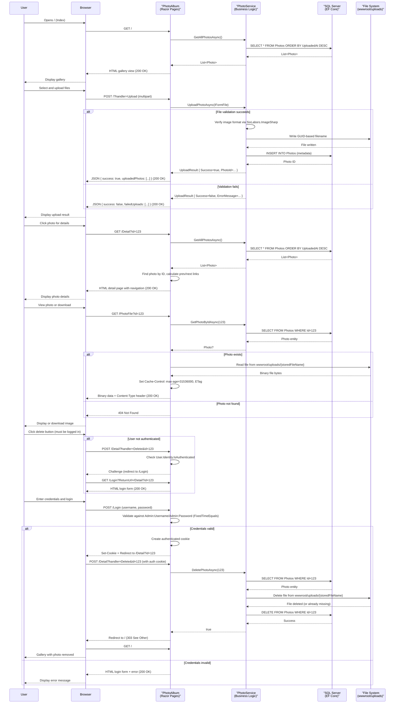

# API & Service Communication Contracts

The PhotoAlbum application is a single-service ASP.NET Core 9.0 web application built on Razor Pages. It exposes a small, focused set of HTTP endpoints for gallery browsing, photo uploads, and administrative operations. Communication is synchronous HTTP with form data and JSON responses; all state-changing operations require cookie-based authentication.

## Service Catalog

| Service | Port | Category | Purpose |
|---------|------|----------|---------|
| PhotoAlbum | 5000 (default) | Web Application | ASP.NET Core 9.0 Razor Pages gallery with file upload, metadata storage, and admin delete functionality |

**Framework Dependencies:**
- Microsoft.EntityFrameworkCore.SqlServer 9.0.9
- Microsoft.EntityFrameworkCore.Design 9.0.9
- SixLabors.ImageSharp 3.1.11
- ASP.NET Core 9.0 (Razor Pages, Authentication, Authorization)

## API Endpoints Inventory

| Service | Method | Path | Request Type | Response Type | Auth Required |
|---------|--------|------|--------------|---------------|---|
| PhotoAlbum | GET | `/` | None | HTML (Razor Page) | No |
| PhotoAlbum | POST | `/?handler=Upload` | Multipart form (IFormFile[]) | JSON: `{ success, uploadedPhotos[], failedUploads[] }` | No |
| PhotoAlbum | GET | `/Detail` | Query: `id` (int) | HTML (Razor Page) | No |
| PhotoAlbum | POST | `/Detail?handler=Delete` | Query: `id` (int) | Redirect to `/` | Yes (Admin) |
| PhotoAlbum | GET | `/PhotoFile` | Query: `id` (int) | Binary file with appropriate MIME type | No |
| PhotoAlbum | GET | `/Login` | None | HTML (Razor Page) | No |
| PhotoAlbum | POST | `/Login` | Form: `Username`, `Password`, `ReturnUrl` (optional) | Redirect to `/` or `ReturnUrl` | No |
| PhotoAlbum | GET | `/Privacy` | None | HTML (Razor Page) | No |

**API Versioning:** Not implemented. All endpoints are implicit version 1.0 (default Razor Pages routing).

**Path Parameters & Query Strings:**
- `/Detail?id={id}` — Retrieves photo by ID for display
- `/PhotoFile?id={id}` — Serves photo file by ID
- `/Login?ReturnUrl={url}` — Supports post-login redirect (validated for local URLs only)

## Management & Observability Endpoints

| Service | Endpoint | Purpose | Custom Metrics |
|---------|----------|---------|---|
| PhotoAlbum | `/Error` | Error page (implicit; triggered on unhandled exceptions) | None |

**Health Check:** No explicit health check endpoint is implemented. The application relies on ASP.NET Core's default health status.

**Logging:** Structured logging via ILogger is configured for all services:
- `PhotoService` — Logs all photo operations (upload, retrieval, deletion)
- `IndexModel`, `DetailModel`, `PhotoFileModel` — Log page access and errors
- `LoginModel` — Logs login failures (not credentials)

**Metrics:** No custom metrics are exported. The application uses standard ASP.NET Core request logging and ILogger output.

## DTOs & Contracts

### Domain Entity
- **Photo** — Represents an uploaded photo with metadata:
  - Immutability: Not immutable (standard C# class with setters)
  - Role: Response type (returned in gallery view and photo detail page)
  - Persistence: Mapped to SQL Server via EF Core (see `data-architecture.md` for field details)

### Transfer Objects
- **UploadResult** — Response object for upload operations:
  - Success (bool)
  - PhotoId (int?, null on failure)
  - FileName (string)
  - ErrorMessage (string?, null on success)
  - Immutability: Not immutable (standard C# class)
  - Role: Internal transfer object, returned as JSON within the `/Index?handler=Upload` response

### Anonymous Objects (JSON Responses)
The `/Index?handler=Upload` endpoint returns a JSON response with anonymous types:
```json
{
  "success": boolean,
  "uploadedPhotos": [
    {
      "id": int,
      "originalFileName": string,
      "filePath": string,
      "uploadedAt": datetime,
      "fileSize": long,
      "width": int?,
      "height": int?
    }
  ],
  "failedUploads": [
    {
      "fileName": string,
      "error": string
    }
  ]
}
```

**Serialization:** System.Text.Json (default in ASP.NET Core 9.0)

**OpenAPI/Swagger:** Not implemented. No Swagger/OpenAPI specification is available.

**Validation:** Field-level validation is defined in the Photo model via Data Annotations (MaxLength, Required, Range). Upload validation occurs in PhotoService.UploadPhotoAsync():
- File size must not exceed 10 MB (configurable)
- File must be a valid raster image (verified via SixLabors.ImageSharp content detection)
- Only JPEG, PNG, GIF, and WebP formats are permitted (validated against actual file content, not client-supplied MIME type)

## Communication Patterns

### Synchronous Communication
All communication is **synchronous HTTP/REST**:
- **POST /Index?handler=Upload** — Client submits multipart form with IFormFile array; server responds with JSON containing upload results
- **GET /Detail?id={id}** — Client fetches photo details; server returns HTML with photo metadata and navigation links
- **POST /Detail?handler=Delete** — Client submits delete request with photo ID; server deletes photo and file, then redirects to index
- **GET /PhotoFile?id={id}** — Client fetches photo file; server streams binary data with appropriate Content-Type

### Asynchronous Communication
None. The application does not use message queues, event brokers, or pub/sub patterns.

### Service Discovery
**Not applicable.** Single-service application with no inter-service communication.

### Resilience Patterns

**Circuit Breaker:** Not implemented.

**Retry:** Not implemented at the HTTP layer. Database operations may fail and are logged; file operations have basic error handling and rollback:
- On database save failure during upload, the partially-saved file is deleted from disk
- On file deletion failure, database deletion proceeds (orphaned file may remain on disk)

**Timeout:** 
- ASP.NET Core default request timeout: 30 seconds (configurable via IIS or hosting layer)
- No explicit application-level timeouts for I/O operations

**Error Handling:**
- Upload failures return JSON with `success: false` and error message
- Photo retrieval failures return HTTP 404
- Unhandled exceptions trigger the `/Error` page and return HTTP 500

### Gateway Aggregation
**Not applicable.** Single-service application with no gateway or service composition.

### Client-Side Load Balancing
**Not applicable.** Single-service deployment.

### Startup Dependency Chain
The application startup sequence:
1. Create WebApplication builder
2. Register Razor Pages, authentication (Cookie), authorization, DbContext, IPhotoService, form options
3. Build application
4. Create uploads directory if missing
5. Run EF migrations (if not in test environment)
6. Configure middleware (exception handler, HTTPS redirect, static files, routing, authentication, authorization)
7. Start listening on configured port

**Database Migration:**
- Auto-runs on startup in all environments except test environment
- Fails fast if migrations cannot be applied (prevents silent data loss)
- Migration files are in `Migrations/` folder; see data model details in `data-architecture.md`

### Security Posture

**Authentication:**
- **Implemented:** Cookie-based authentication using ASP.NET Core `CookieAuthenticationDefaults`
- **Mechanism:** Credentials (username/password) are validated against configuration values (`Admin:Username`, `Admin:Password`)
- **Password Comparison:** Fixed-time comparison (using `CryptographicOperations.FixedTimeEquals`) prevents timing attacks
- **Login Flow:** POST to `/Login` with username and password; creates authenticated cookie and redirects to return URL or index

**Authorization:**
- **Read operations** (GET gallery, view photo, download file): Public (no authentication required)
- **Write operations** (POST upload): Public (no authentication required)
- **Delete operation** (POST delete): Admin-only (checked at handler level; anonymous users are redirected to login)

**Transport Security:**
- **HTTPS/TLS:** Enabled in non-development environments via `app.UseHttpsRedirection()` and HSTS middleware (`Strict-Transport-Security` header with 30-day max-age)
- **HTTPS Redirect:** Configured; HTTP requests are redirected to HTTPS

**Input Validation:**
- File uploads are validated for size, MIME type (via content detection, not client-supplied Content-Type), and image format
- Photo IDs are parsed from query strings and validated as integers
- Login credentials are compared against configuration (no SQL injection or injection attacks possible)

**Known Security Implementation Details:**
- File upload validation uses SixLabors.ImageSharp to detect actual image format (mitigates CWE-434 unrestricted file upload)
- Credentials are never hard-coded; always read from configuration or environment variables (mitigates CWE-798 hardcoded credentials)
- Fixed-time string comparison for password validation (mitigates CWE-208 timing attack)
- Authentication is required for state-changing operations like delete (mitigates CWE-306 missing authentication)
- HTTPS redirect enforced in production (mitigates CWE-295 improper certificate validation / missing TLS)

## Service Technology Matrix

| Capability | PhotoAlbum | Notes |
|---|---|---|
| **Web Framework** | Razor Pages | ASP.NET Core 9.0 server-side rendering |
| **Data Access** | EF Core 9.0 | SQL Server LocalDB with DbSet<Photo> |
| **Service Discovery** | None | Single service; no discovery needed |
| **Gateway** | None | Direct HTTP access to Razor Pages endpoints |
| **Actuator/Health** | None | No dedicated health check endpoint |
| **Caching** | Built-in response caching | Static files: 1-hour max-age; photo files: 1-year max-age with ETag validation |
| **Metrics Export** | ILogger only | No Prometheus, Application Insights, or external metrics integration |
| **Authentication** | Cookie | Username/password validated against configuration |
| **HTTPS/TLS** | ✓ | Enforced in production via HSTS and redirect middleware |

## Service Communication Sequence



**Key Flow Notes:**

1. **Unauthenticated Access:** Gallery viewing, file download, and photo details are publicly accessible.

2. **Authentication Requirement:** Only the delete operation requires authentication. Unauthorized DELETE requests trigger an HTTP 401 challenge, redirecting to login with a `ReturnUrl` parameter for post-login redirect.

3. **File Validation:** Upload validation is strict — SixLabors.ImageSharp detects actual image format (not trusted client Content-Type or filename). Validation failure returns JSON error without writing to disk.

4. **Transactional Consistency:** File upload is committed to disk first, then the photo metadata is persisted. If database save fails, the file is rolled back (deleted) to prevent orphaned files. If file deletion fails, database deletion proceeds (acceptable for this scenario).

5. **Caching:** Static assets (CSS, JS) are cached for 1 hour; photo files are cached for 1 year with ETag validation for cache revalidation.

6. **No External Dependencies:** All logic is handled within the single PhotoAlbum service. No calls to external APIs, message brokers, or other services.
