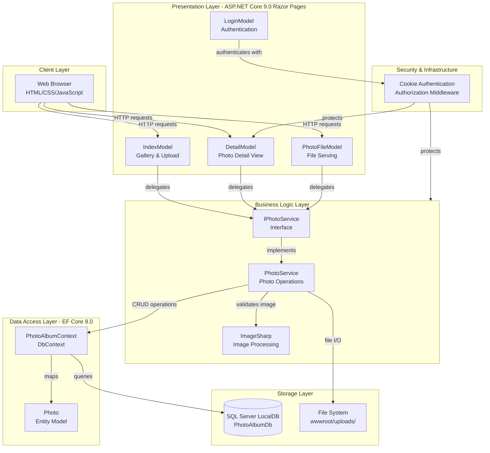
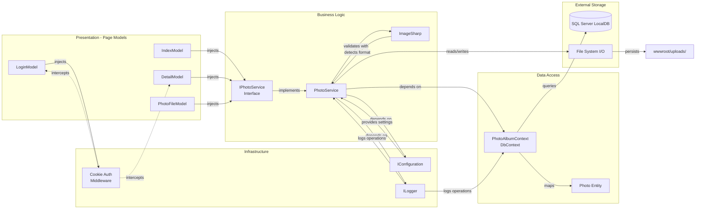

# Architecture Diagram

PhotoAlbum is an ASP.NET Core 9.0 Razor Pages web application that provides a photo gallery with upload, viewing, and deletion capabilities. It demonstrates a clean three-layer architecture with clear separation of concerns between presentation, business logic, and data access layers.

## Application Architecture

### Technology Stack Summary

| Layer | Technology | Version | Purpose |
|-------|-----------|---------|---------|
| **Presentation** | ASP.NET Core Razor Pages | 9.0 | Server-side page rendering and request handling |
| **Business Logic** | C# / .NET | 9.0 | Photo CRUD operations, validation, image processing |
| **Image Processing** | SixLabors.ImageSharp | 3.1.11 | Image format detection and dimension extraction |
| **Data Access** | Entity Framework Core | 9.0 | ORM for database operations and mapping |
| **Database** | SQL Server LocalDB | Latest | Relational data storage for photo metadata |
| **File Storage** | Local File System | N/A | GUID-based image file storage in wwwroot/uploads |
| **Authentication** | ASP.NET Core Identity (Cookie-based) | 9.0 | User authentication and authorization |
| **Testing** | xUnit | Latest | Unit and integration test framework |

### Data Storage & External Services

The application uses **SQL Server LocalDB** for persisting photo metadata (filename, dimensions, MIME type, upload timestamp) and a **local file system** (wwwroot/uploads/) for storing the actual image files using GUID-based naming to prevent collisions and directory traversal attacks. The architecture supports future migration to cloud storage (e.g., Azure Blob Storage) by abstracting storage through the IPhotoService interface. Photo files are served through the PhotoFileModel page with cache headers and ETags to optimize bandwidth.

### Key Architectural Decisions

- **Service Layer Abstraction**: The IPhotoService interface provides a clean contract for photo operations, enabling future storage backend swaps (local filesystem → Azure Blob Storage) without changing page models or other consumers.
- **Transactional Consistency**: File deletion on database save failure ensures no orphaned files on disk, maintaining integrity across both storage layers.
- **Security-First Image Handling**: Images are validated by actual content (via ImageSharp) rather than trusting client-supplied MIME types or file extensions, preventing malicious uploads (CWE-434, CWE-79). Stored filenames use GUIDs to prevent directory traversal attacks (CWE-22).
- **Configuration-Driven Policies**: File size limits and allowed MIME types are externalized in appsettings.json, enabling environment-specific tuning without code changes.

## Component Relationships

### Component Inventory

| Component | Layer | Type | Responsibility |
|-----------|-------|------|-----------------|
| **IndexModel** | Presentation | Razor Page Model | Display photo gallery grid and handle multi-file upload requests |
| **DetailModel** | Presentation | Razor Page Model | Display full-size photo, manage photo navigation (prev/next), and handle deletion (authenticated only) |
| **PhotoFileModel** | Presentation | Razor Page Model | Serve photo files with content-type headers and cache directives |
| **LoginModel** | Presentation | Razor Page Model | Handle user authentication via cookie-based login |
| **IPhotoService** | Business Logic | Service Interface | Contract for photo CRUD operations (GetAllPhotos, GetPhotoById, UploadPhoto, DeletePhoto) |
| **PhotoService** | Business Logic | Service Implementation | Core business logic: file validation, image format detection, upload with rollback, retrieval, and deletion |
| **ImageSharp** | Business Logic | External Library | Detect actual image format/dimensions from file content (prevents malicious uploads) |
| **PhotoAlbumContext** | Data Access | EF Core DbContext | Map Photo entity to database, manage database queries and transactions |
| **Photo** | Data Access | Entity Model | Photo metadata: ID, original/stored filename, file path, size, MIME type, dimensions, upload timestamp |
| **Cookie Auth Middleware** | Infrastructure | Middleware | Authenticate/authorize users, protect sensitive operations (photo deletion) |
| **IConfiguration** | Infrastructure | .NET Service | Provide application settings (file size limits, allowed MIME types, database connection) |
| **ILogger** | Infrastructure | .NET Service | Log diagnostic information for troubleshooting and auditing |
| **SQL Server LocalDB** | Storage | Database | Persist photo metadata and indexes for chronological queries |
| **File System** | Storage | Local Storage | Store actual photo files in wwwroot/uploads/ with GUID-based names |
