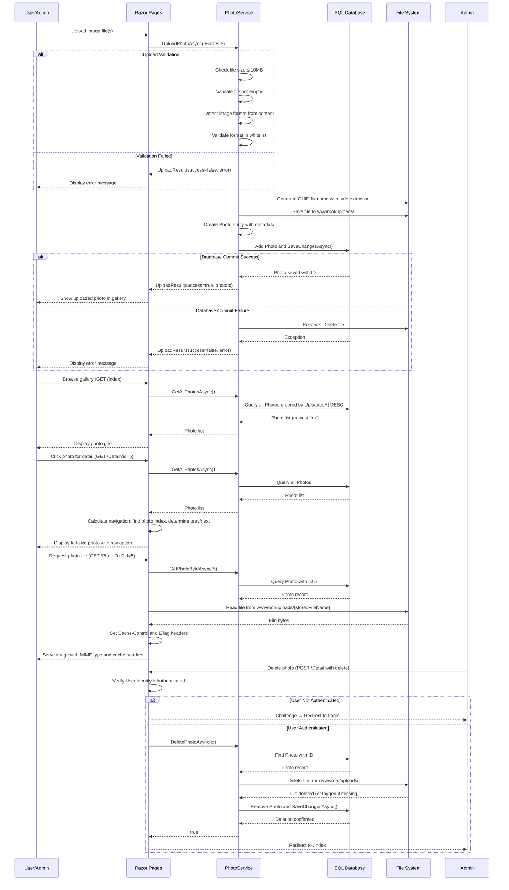

# Core Business Workflows

PhotoAlbum is a photo gallery application that enables users to upload, view, and manage digital photos with chronological browsing capabilities. The application provides a user-friendly interface for organizing and displaying images while maintaining data integrity and file consistency.

## Domain Entities

| Entity | Service / Bounded Context | Description | Key Relationships |
|--------|---------------------------|-------------|-------------------|
| **Photo** | Photo Gallery Management | Core entity representing an uploaded image with metadata including original filename, stored filename, file size, MIME type, dimensions, and upload timestamp. Serves as the central aggregate in the photo gallery domain. | Primary aggregate; referenced by all business workflows. Maintains bidirectional relationship between database metadata and file system storage. |

## Service-to-Domain Mapping

| Service | Domain Context | Owned Entities | External Dependencies |
|---------|----------------|----------------|----------------------|
| **PhotoService** | Photo Gallery Management | Photo | File system (local storage), Database (SQL Server LocalDB), Image format detection library (SixLabors.ImageSharp) |

*Note: This is a single-module monolithic application with a single service managing all photo-related operations.*

## Primary Workflows

### Workflow 1: Photo Upload

**Entry Point:** User submits POST request to `/Index` with one or more image files via multipart form data.

**Steps:**
1. User selects image file(s) and initiates upload
2. PhotoService validates file size against `FileUpload:MaxFileSizeBytes` (10MB limit)
3. PhotoService performs content-based image format detection using SixLabors.ImageSharp to determine true format regardless of file extension or client-supplied Content-Type
4. Detected format is validated against whitelist of allowed extensions: jpg, jpeg, png, gif, webp
5. Safe filename is generated using GUID with detected format's extension
6. File is saved to `wwwroot/uploads/` directory on disk
7. Photo entity is created with metadata: original filename, stored filename, file path, file size, MIME type, image dimensions (width × height), and upload timestamp
8. Photo metadata is persisted to database
9. **Transactional Rollback:** If database save fails, the file is automatically deleted from disk to maintain consistency
10. Response returns upload status with photo ID and details for successfully uploaded photos, or error messages for rejected uploads

**Business Rules Involved:**
- File size validation: file must be ≤ 10MB
- Empty file rejection: file.Length must be > 0
- Image format validation: only raster images (JPEG, PNG, GIF, WebP) accepted
- Content-based validation: image format determined from file content, not filename or Content-Type header (CWE-434 prevention)
- Transactional consistency: file deletion on database failure ensures no orphaned files
- Filename safety: GUID-based names prevent path traversal and directory listing attacks

### Workflow 2: Photo Gallery Discovery

**Entry Point:** User navigates to `/Index` page (GET request).

**Steps:**
1. Index page handler calls PhotoService.GetAllPhotosAsync()
2. PhotoService queries database for all Photo entities, ordering by UploadedAt descending (newest first)
3. Photo list is returned to Razor page
4. Page renders photo grid with thumbnails or metadata display
5. Each photo thumbnail links to detail view or serves cached static asset

**Business Rules Involved:**
- Chronological ordering: photos displayed newest-first by upload timestamp
- Error resilience: if database query fails, empty photo list returned and page renders gracefully
- Caching: static files and photo metadata cached with appropriate HTTP cache headers

### Workflow 3: Photo Detail View and Navigation

**Entry Point:** User clicks on photo to view full-size detail (`/Detail?id={photoId}`).

**Steps:**
1. User requests detail page with photo ID parameter
2. DetailModel handler validates ID is not null; returns NotFound if missing
3. PhotoService fetches all photos from database (ordered newest-first) to calculate navigation context
4. Photo with matching ID located in result set
5. If photo not found, NotFound response returned
6. Current photo index determined in ordered list
7. **Navigation Calculation:** Next photo ID determined from list position (newer photo at previous index) and previous photo ID determined from list position (older photo at next index)
8. Detail page rendered with full-size photo, metadata, and previous/next navigation links
9. User may click previous/next links to navigate chronologically through gallery

**Business Rules Involved:**
- Navigation context requires all photos to be loaded to determine adjacent photos by upload timestamp
- Circular navigation: first photo has no "next" link, last photo has no "previous" link
- Chronological ordering preserved in navigation (newer → older)
- Error handling: if photo ID invalid or database query fails, NotFound returned

### Workflow 4: Photo File Serving

**Entry Point:** Browser requests image file via `/PhotoFile?id={photoId}` or direct static path reference.

**Steps:**
1. PhotoFile handler receives photo ID parameter
2. PhotoService queries database to fetch Photo metadata by ID
3. If photo record not found, NotFound response returned
4. Physical file path constructed from stored filename in Photo.FilePath
5. Existence check performed on physical file at `wwwroot/uploads/{storedFileName}`
6. If physical file missing, NotFound response returned and error logged
7. File bytes read from disk
8. Response headers configured for HTTP caching:
   - Cache-Control: public, max-age=31536000 (1 year)
   - ETag: "{photoId}-{uploadedAt.Ticks}" for cache validation and 304 Not Modified responses
9. File served with appropriate MIME type from Photo.MimeType
10. Browser may use cached version on subsequent requests if ETag validation succeeds

**Business Rules Involved:**
- Indirect file access: photos served through authenticated handler, not direct filesystem access
- Cache validation: ETags enable browsers to reuse cached files and reduce bandwidth
- Data integrity check: verifies database record and physical file both exist before serving
- Error resilience: missing file returns 500 Internal Server Error with logging for diagnostic investigation

### Workflow 5: Photo Deletion

**Entry Point:** Authenticated admin user submits POST request to delete photo from detail page.

**Steps:**
1. User (must be admin) navigates to photo detail page
2. Admin clicks delete button, triggering POST request to `/Detail` with OnPostDeleteAsync handler
3. **Authentication Check:** Handler verifies User.Identity is not null and IsAuthenticated is true (CWE-306 prevention)
4. If not authenticated, Challenge response issued, redirecting to login page
5. PhotoService.DeletePhotoAsync(id) invoked
6. PhotoService locates Photo record by ID
7. If not found, returns false and handler may redirect with error message
8. **File Deletion:** Physical file deleted from `wwwroot/uploads/` directory
9. If file deletion fails (file not found or permission error), deletion continues to next step after logging error
10. Photo record removed from database
11. Database changes committed
12. Handler redirects to `/Index` gallery view
13. If exception occurs during deletion, error message stored in TempData and handler redirects back to detail page

**Business Rules Involved:**
- Admin-only operation: requires authentication and authorization (CWE-306 mitigation)
- Cascading deletion: both database record and physical file removed
- Decoupled failures: file deletion failure does not block database deletion (best-effort cleanup)
- Audit trail: all deletions logged with photo ID and timestamp
- User feedback: error messages surface via TempData if deletion fails

## Cross-Service Data Flows

**Note:** PhotoAlbum is a single-service monolithic application. All data flows occur within the PhotoService and associated database/file system.

**Primary Data Flow:**
1. Upload Flow: User file → FormFile validation → Image format detection → GUID filename generation → disk storage → Database record creation
2. Gallery Flow: Database query → Photo list sorted by UploadedAt descending → Razor page render
3. Detail Flow: Database query (all photos) → index calculation → navigation IDs computed in memory
4. File Serving Flow: Database lookup (Photo record) → file system path construction → file I/O → HTTP response
5. Deletion Flow: Database lookup (Photo record) → file deletion → database record deletion → response

**Storage Strategy:**
- **Database:** SQL Server LocalDB stores Photo metadata (filename, size, dimensions, timestamps)
- **File System:** `wwwroot/uploads/` stores actual image files with GUID-based names
- **Consistency Mechanism:** Transactional rollback deletes orphaned files if database commit fails

## Business Workflow Sequence

## Business Rules & Decision Logic

### Validation Rules

| Rule | Scope | Constraint | Purpose |
|------|-------|-----------|---------|
| **File Size Limit** | Upload | File.Length ≤ 10,485,760 bytes (10MB) | Prevent storage exhaustion and upload timeouts |
| **Non-Empty File** | Upload | File.Length > 0 | Reject malformed or empty uploads |
| **Image Format Detection** | Upload | Content-based format detection via SixLabors.ImageSharp, not filename or Content-Type | Prevent CWE-434 (unrestricted file upload) and CWE-79 (XSS via .html/.svg uploads) |
| **Allowed Raster Formats** | Upload | Only jpg, jpeg, png, gif, webp extensions allowed (based on detected format) | Restrict to safe image formats; prevent vector/executable uploads |
| **Photo ID Not Null** | Detail View, Photo Serving, Deletion | id parameter must not be null | Prevent invalid requests and resource enumeration |
| **Photo Exists in Database** | Detail View, Photo Serving, Deletion | Photo record with ID must exist | Verify resource availability before processing |
| **Physical File Exists** | Photo Serving | File must exist at `wwwroot/uploads/{storedFileName}` | Ensure consistency between metadata and storage |
| **Authentication Required** | Deletion | User.Identity must be authenticated | Prevent anonymous destructive operations (CWE-306) |

### Decision Logic & State Transitions

| Decision Point | Condition | True Path | False Path |
|---|---|---|---|
| **File Size Valid?** | file.Length ≤ maxFileSizeBytes | Proceed to format detection | Return error; reject upload |
| **File Non-Empty?** | file.Length > 0 | Proceed to format detection | Return error; reject upload |
| **Image Format Valid?** | ImageSharp can decode file AND detected format in whitelist | Save to disk; create entity | Return error; reject upload; do not save |
| **Database Save Success?** | SaveChangesAsync() committed without exception | Return success with photo ID | Rollback file deletion; return error |
| **Photo Exists in Detail View?** | FirstOrDefault(p => p.Id == id) not null | Load photo; calculate navigation | Return NotFound(404) |
| **Photo Exists for Serving?** | Photo record exists AND physical file exists | Serve file with cache headers | Return NotFound(404); log error |
| **User Authenticated for Delete?** | User.Identity.IsAuthenticated == true | Proceed with deletion | Issue Challenge; redirect to login |
| **Delete Success?** | Photo.Remove() and SaveChangesAsync() committed | Redirect to /Index | Redirect to /Detail with error message |

### Transactional Consistency

- **Upload Atomicity:** File disk save and database insert combined as single logical transaction. If database commit fails, file is deleted to prevent orphaned storage.
- **Deletion Atomicity:** File deletion and database record deletion performed in sequence. File deletion failure does not block database deletion but is logged for investigation.
- **Query Consistency:** All photos fetched as single batch for detail view navigation calculation to ensure consistent ordering; index positions recalculated based on full dataset.

### Business Constraints

| Constraint | Scope | Enforcement |
|---|---|---|
| **Chronological Ordering** | Gallery display, navigation | Photos retrieved ordered by UploadedAt DESC; index navigation calculated from sorted list position |
| **Filename Uniqueness** | File system | GUID-based filenames with extension; collision probability negligible |
| **Single Admin Role** | Authorization | Authentication required for delete; no fine-grained role separation (implicit admin via authenticated status) |
| **File Path Safety** | File operations | GUID-based names prevent path traversal; stored paths validated before file I/O |
| **Metadata Completeness** | Photo Entity | All required fields (OriginalFileName, StoredFileName, FilePath, FileSize, MimeType, UploadedAt) enforced at database schema level |

### Computed & Derived Values

| Value | Source | Calculation | Business Impact |
|---|---|---|---|
| **Image Dimensions** | SixLabors.ImageSharp.Image.Identify() | Width and Height extracted after format detection | Supports gallery UI layout and aspect ratio calculations |
| **Stored File Name** | Guid.NewGuid() + detected format extension | Ensures unique names and prevents collision/traversal attacks | Enables safe multi-user concurrent uploads |
| **File Path** | `{uploadPath}/{storedFileName}` | Relative path stored for portability; full path reconstructed at serving time | Supports cloud storage migration (local → Azure Blob) |
| **Navigation IDs** | List index calculation | Previous ID = list[index+1], Next ID = list[index-1] | Enables chronological gallery navigation |
| **ETag Header** | photoId + uploadedAt.Ticks | Composite value guarantees change on re-upload or database update | Reduces bandwidth via browser cache validation |

### Cross-Cutting Concerns

**Authorization:** Delete operations require `User.Identity.IsAuthenticated == true`. Gallery and detail views are publicly readable. File serving via `/PhotoFile` endpoint is public (unauthenticated). Implicit admin role—no role-based granularity.

**Error Handling:**
- Validation errors: Return user-friendly messages without exposing system details
- File I/O errors: Logged with full path and exception; graceful fallback (file not found → 404 response)
- Database errors: Logged with operation details; transactional rollback triggers compensating action (file deletion on commit failure)
- Unexpected errors: Caught at handler level; generic error message returned; full details logged for investigation

**Audit & Logging:**
- Upload: Success logged with filename and photo ID; validation failures logged with reason
- Deletion: Success logged with photo ID; failures logged with exception details
- File serving: Debug log on successful serve; error log if physical file missing despite database record
- Database errors: Full exception chain logged with operation context

**Caching Strategy:**
- Static assets (CSS, JS): Cache-Control: public, max-age=3600 (1 hour)
- Photo files: Cache-Control: public, max-age=31536000 (1 year) with ETag validation
- Photo metadata in detail view: Not explicitly cached; fetched fresh on each request for real-time navigation accuracy
