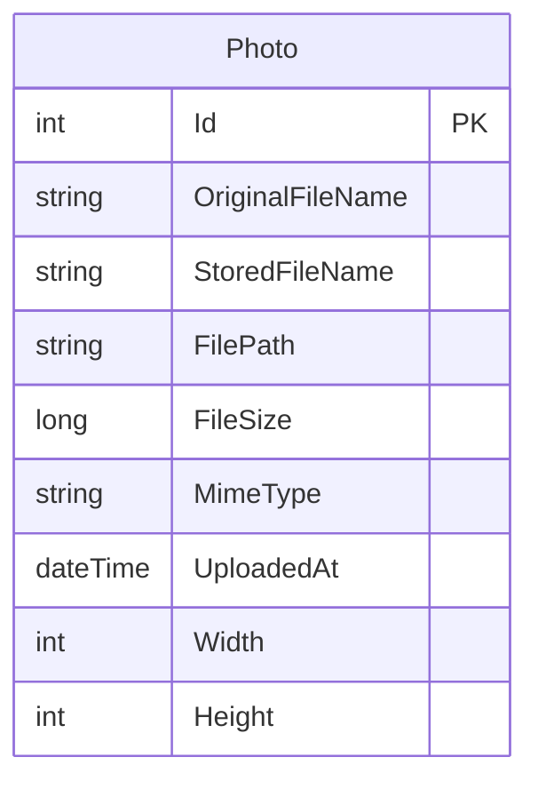

# Data Architecture & Persistence Layer

PhotoAlbum is a single-entity ASP.NET Core application using Entity Framework Core 9.0 with SQL Server LocalDB. The data model consists of a single `Photo` entity with metadata tracking for uploaded images.

## Database Configuration

| Service/Module | DB Type | Profile | Driver | Connection | Migration Tool |
|---|---|---|---|---|---|
| PhotoAlbum | SQL Server LocalDB | All (Development/Production) | SqlServer 9.0.9 | `(localdb)\mssqllocaldb;Database=PhotoAlbumDb;Trusted_Connection=true;MultipleActiveResultSets=true` | EF Core Migrations |

The application uses SQL Server LocalDB as its primary database in all environments. Connection strings are defined in `appsettings.json` and database migrations are automatically applied on startup via `context.Database.MigrateAsync()` (except when `IsTestEnvironment` flag is true).

## Data Ownership per Service

| Service | Tables Owned | ORM Framework | Caching | Notes |
|---|---|---|---|---|
| PhotoAlbum | Photos | Entity Framework Core 9.0 | HTTP Static File Cache | Single-service application; all data owned by core PhotoAlbum module |

The `PhotoService` acts as the business logic layer between the Razor Pages and the database, encapsulating all database operations. No cross-service data access patterns exist due to the monolithic single-entity design.

## Entity Model

The `Photo` entity (C#: `PhotoAlbum/Models/Photo.cs`) stores uploaded image metadata:
- **Id**: Auto-incrementing primary key
- **OriginalFileName**: User-supplied filename (max 255 chars)
- **StoredFileName**: GUID-based filename with detected extension (max 255 chars) for safe storage
- **FilePath**: Relative path from wwwroot (e.g., `/uploads/abc123.jpg`; max 500 chars)
- **FileSize**: File size in bytes (required, range 1 to long.MaxValue)
- **MimeType**: MIME type (e.g., `image/jpeg`; max 50 chars, required)
- **UploadedAt**: UTC timestamp of upload (required)
- **Width** (nullable): Image width in pixels, populated after upload via ImageSharp
- **Height** (nullable): Image height in pixels, populated after upload via ImageSharp

All string properties are configured as required with database constraints. The `UploadedAt` column has a descending index (`IX_Photos_UploadedAt`) to optimize chronological queries used by `GetAllPhotosAsync()`.

## Key Repository Methods

| Service | Repository | Notable Methods | Purpose |
|---|---|---|---|
| PhotoAlbum | DbSet<Photo> (via EF Core) | `DbContext.Photos.OrderByDescending(p => p.UploadedAt)` | Retrieve all photos ordered by upload date (newest first) for gallery grid display |
| PhotoAlbum | DbSet<Photo> (via EF Core) | `DbContext.Photos.FindAsync(id)` | Retrieve single photo by ID for detail view |
| PhotoAlbum | DbSet<Photo> (via EF Core) | `DbContext.Photos.AddAsync()` then `SaveChangesAsync()` | Insert new Photo record after file validation and disk write |
| PhotoAlbum | DbSet<Photo> (via EF Core) | `DbContext.Photos.Remove()` then `SaveChangesAsync()` | Delete photo record after file deletion from disk |

The `PhotoAlbumContext` exposes a single `DbSet<Photo>` collection. All CRUD operations flow through the `IPhotoService` interface, which encapsulates transaction management and error handling. The service ensures database write succeeds before considering upload complete, and performs file rollback on database save failure.

## Caching Strategy

**HTTP Static File Caching:**
The application configures HTTP Cache-Control headers for static files (images in `wwwroot/uploads/`) with a 1-hour TTL (`Cache-Control: public,max-age=3600`). This is set via ASP.NET Core's `StaticFileOptions.OnPrepareResponse` callback in `Program.cs`.

**Database Query Caching:**
No explicit data caching layer (Redis, Caffeine, EhCache) is configured. The `GetAllPhotosAsync()` method executes a full table scan ordered by `UploadedAt DESC`, leveraging the descending index. Single-photo lookups (`GetPhotoByIdAsync`) use EF Core's identity map.

**Rationale:** Photo metadata is assumed to have moderate cardinality (hundreds to thousands of records in typical usage), and the ordered query is performed on every gallery page load. In-memory database caching or a distributed cache could reduce database load for read-heavy workloads, but the current design prioritizes simplicity and always-current metadata.

## Data Ownership Boundaries

**Shared vs Isolated Data Store:**
PhotoAlbum is a monolithic single-service application with no inter-service data boundaries. All data is stored in a single SQL Server LocalDB instance (`PhotoAlbumDb`). There are no cross-service data access patterns, remote API calls for data retrieval, or database-per-service topologies.

**Cross-Service Data Access:**
Not applicable. All data access is performed by the `PhotoAlbum` service through `IPhotoService`, which delegates to `PhotoAlbumContext`. External systems (e.g., Azure Blob Storage in modernization scenarios) would be accessed through service abstractions, but current implementation stores files locally in `wwwroot/uploads/`.

**Data Aggregation:**
No aggregation or bulk query methods are required, as the single entity model eliminates multi-entity joins or cross-service data correlation.

### Data Classification & Sensitivity

| Entity | Sensitive Fields | Classification | Controls in Place |
|---|---|---|---|
| Photo | OriginalFileName | None | None required; filename is user-supplied metadata, not PII/PHI/PCI |
| Photo | FilePath | None | None required; derived from GUID and image format, not user-facing |
| Photo | MimeType | None | None required; technical metadata |
| Photo | UploadedAt | None | None required; timestamp only |
| Photo | Width, Height | None | None required; image dimensions only |

**Summary:** The `Photo` entity contains no PII, PHI, or PCI data. Uploaded images themselves may contain sensitive visual content, but the database schema stores only technical metadata. No encryption-at-rest, data masking, or field-level access controls are configured at the database level. File-level security is enforced via ASP.NET Core authentication (photo deletion requires login) and authorization middleware.

