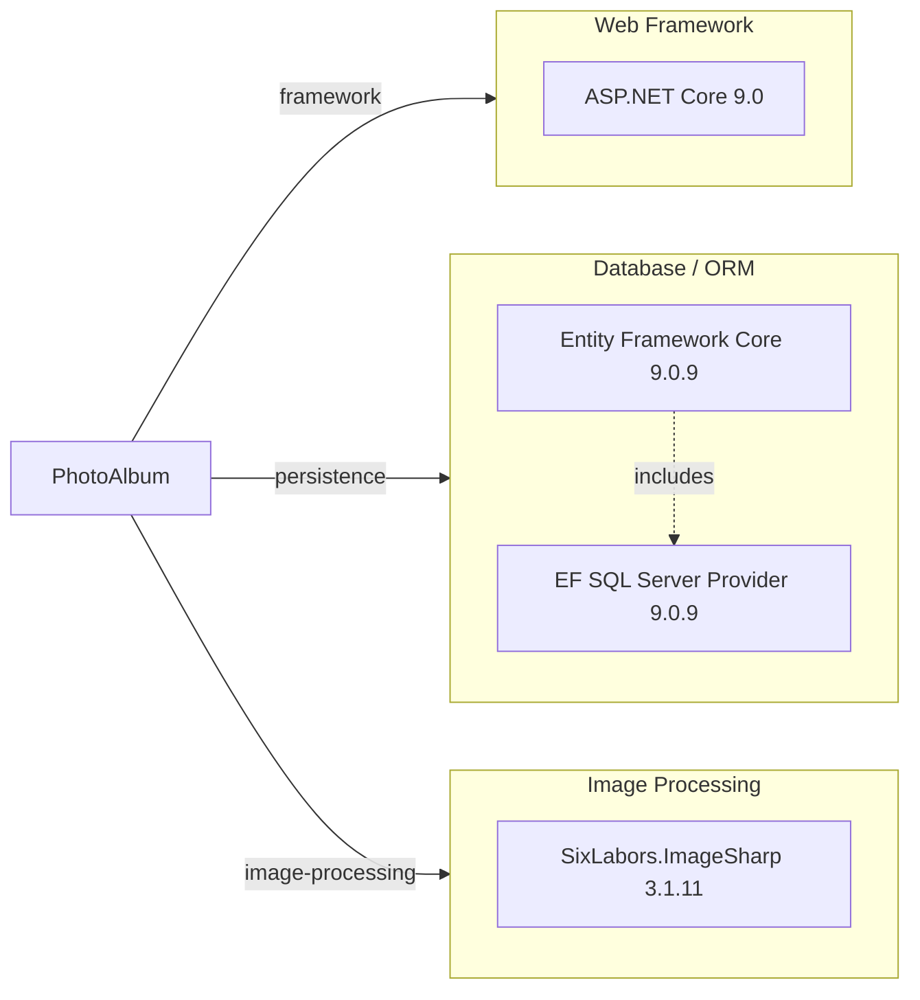

# Dependency Map

PhotoAlbum is an ASP.NET Core 9.0 Razor Pages application with 6 declared external dependencies (3 production, 3 test-scoped).

## Dependencies

### Dependency Summary

| Category | Count | Key Libraries | Notes |
|----------|-------|----------------|-------|
| Web Framework | 1 | ASP.NET Core 9.0 | Modern .NET web stack, latest LTS release |
| Database / ORM | 2 | Entity Framework Core 9.0.9, EF SQL Server Provider 9.0.9 | Modern ORM with EF Core; no legacy EF6 |
| Image Processing | 1 | SixLabors.ImageSharp 3.1.11 | Open-source, modern image manipulation library |

### Version & Compatibility Risks

**Low Risk**: The application targets .NET 9.0, which is the latest stable release (2024). Entity Framework Core 9.0.9 is current and receives regular updates. SixLabors.ImageSharp 3.1.11 is a recent version. No end-of-life dependencies detected. All selected libraries have active maintenance and strong community support.

### Notable Observations

- **Minimal dependency footprint**: Only 3 production dependencies demonstrates a lean, focused architecture well-suited for modernization tasks.
- **Current .NET version**: ASP.NET Core 9.0 is the latest LTS release; no framework upgrades necessary for this application.
- **Cloud-ready design**: Entity Framework Core abstraction (via IPhotoService) makes transition to Azure Blob Storage or other cloud storage straightforward without major architectural changes.
- **Single responsibility principle**: Each dependency serves a distinct purpose (web framework, ORM, image processing) with no functional overlap.

## Test Dependencies

| Framework | Version | Notes |
|-----------|---------|-------|
| xUnit | 2.9.2 | Modern .NET testing framework |
| xunit.runner.visualstudio | 2.8.2 | Visual Studio test runner integration |
| Microsoft.NET.Test.Sdk | 17.12.0 | Core test infrastructure for .NET |
| Microsoft.AspNetCore.Mvc.Testing | 9.0.9 | Integration testing utilities for ASP.NET Core |
| Microsoft.EntityFrameworkCore.InMemory | 9.0.9 | In-memory database for test isolation |
| coverlet.collector | 6.0.2 | Code coverage collection tool |

**Total test-scope dependencies**: 6

The test infrastructure is modern and complete. xUnit provides a robust testing framework, complemented by EF Core's in-memory provider for isolated database testing. Integration testing is supported via ASP.NET Core test utilities. Code coverage tracking is included via coverlet. No test infrastructure gaps detected.
