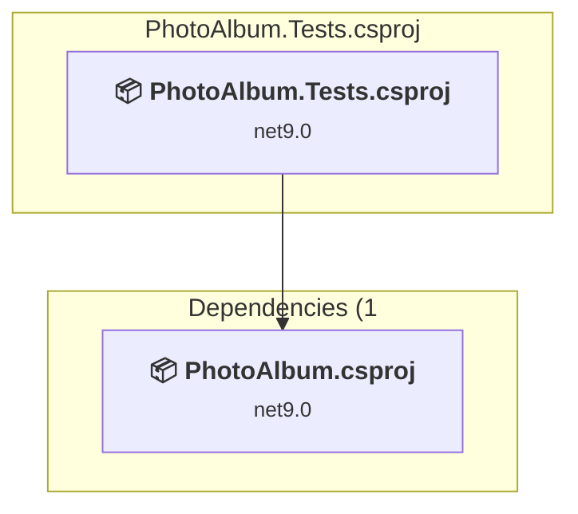
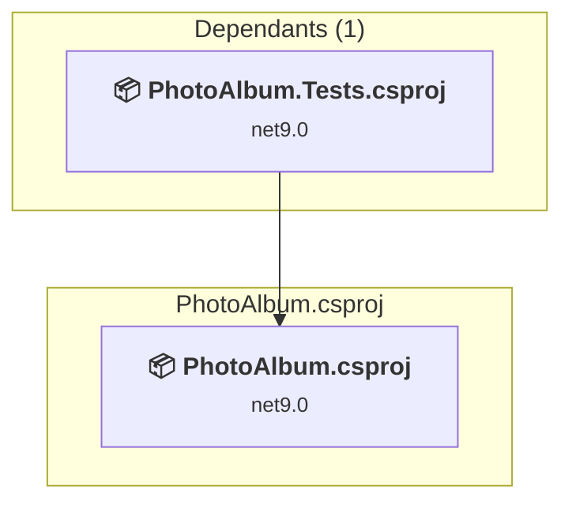

# Projects and dependencies analysis

This document provides a comprehensive overview of the projects and their dependencies in the context of upgrading to .NETCoreApp,Version=v10.0.

## Table of Contents

- [Executive Summary](#executive-Summary)
  - [Highlevel Metrics](#highlevel-metrics)
  - [Projects Compatibility](#projects-compatibility)
  - [Package Compatibility](#package-compatibility)
  - [API Compatibility](#api-compatibility)
  - [Binding Redirect Configuration](#binding-redirect-configuration)
- [Aggregate NuGet packages details](#aggregate-nuget-packages-details)
- [Top API Migration Challenges](#top-api-migration-challenges)
  - [Technologies and Features](#technologies-and-features)
  - [Most Frequent API Issues](#most-frequent-api-issues)
- [Projects Relationship Graph](#projects-relationship-graph)
- [Project Details](#project-details)

  - [PhotoAlbum.Tests\PhotoAlbum.Tests.csproj](#photoalbumtestsphotoalbumtestscsproj)
  - [PhotoAlbum\PhotoAlbum.csproj](#photoalbumphotoalbumcsproj)

## Executive Summary

### Highlevel Metrics

| Metric | Count | Status |
| :--- | :---: | :--- |
| Total Projects | 2 | All require upgrade |
| Total NuGet Packages | 119 | 5 need upgrade |
| Total Code Files | 26 |  |
| Total Code Files with Incidents | 4 |  |
| Total Lines of Code | 1820 |  |
| Total Number of Issues | 11 |  |
| Estimated LOC to modify | 4+ | at least 0,2% of codebase |

### Projects Compatibility

| Project | Target Framework | Difficulty | Package Issues | API Issues | Binding Issues | Est. LOC Impact | Description |
| :--- | :---: | :---: | :---: | :---: | :---: | :---: | :--- |
| [PhotoAlbum.Tests\PhotoAlbum.Tests.csproj](#photoalbumtestsphotoalbumtestscsproj) | net9.0 | 🟢 Low | 3 | 0 | 0 |  | DotNetCoreApp, Sdk Style = True |
| [PhotoAlbum\PhotoAlbum.csproj](#photoalbumphotoalbumcsproj) | net9.0 | 🟢 Low | 2 | 4 | 0 | 4+ | AspNetCore, Sdk Style = True |

### Package Compatibility

| Status | Count | Percentage |
| :--- | :---: | :---: |
| ✅ Compatible | 114 | 95,8% |
| ⚠️ Incompatible | 1 | 0,8% |
| 🔄 Upgrade Recommended | 4 | 3,4% |
| ***Total NuGet Packages*** | ***119*** | ***100%*** |

### API Compatibility

| Category | Count | Impact |
| :--- | :---: | :--- |
| 🔴 Binary Incompatible | 3 | High - Require code changes |
| 🟡 Source Incompatible | 0 | Medium - Needs re-compilation and potential conflicting API error fixing |
| 🔵 Behavioral change | 1 | Low - Behavioral changes that may require testing at runtime |
| ✅ Compatible | 1746 |  |
| ***Total APIs Analyzed*** | ***1750*** |  |

## Aggregate NuGet packages details

| Package | Current Version | Suggested Version | Projects | Description |
| :--- | :---: | :---: | :--- | :--- |
| Azure.Core | 1.38.0 |  | [PhotoAlbum.csproj](#photoalbumphotoalbumcsproj) [PhotoAlbum.Tests.csproj](#photoalbumtestsphotoalbumtestscsproj) | ✅Compatible |
| Azure.Identity | 1.11.4 |  | [PhotoAlbum.csproj](#photoalbumphotoalbumcsproj) [PhotoAlbum.Tests.csproj](#photoalbumtestsphotoalbumtestscsproj) | ✅Compatible |
| coverlet.collector | 6.0.2 |  | [PhotoAlbum.Tests.csproj](#photoalbumtestsphotoalbumtestscsproj) | ✅Compatible |
| Humanizer.Core | 2.14.1 |  | [PhotoAlbum.csproj](#photoalbumphotoalbumcsproj) | ✅Compatible |
| Microsoft.AspNetCore.Mvc.Testing | 9.0.9 | 10.0.11 | [PhotoAlbum.Tests.csproj](#photoalbumtestsphotoalbumtestscsproj) | NuGet package upgrade is recommended |
| Microsoft.AspNetCore.TestHost | 9.0.9 |  | [PhotoAlbum.Tests.csproj](#photoalbumtestsphotoalbumtestscsproj) | ✅Compatible |
| Microsoft.Bcl.AsyncInterfaces | 1.1.1 |  | [PhotoAlbum.Tests.csproj](#photoalbumtestsphotoalbumtestscsproj) | ✅Compatible |
| Microsoft.Bcl.AsyncInterfaces | 7.0.0 |  | [PhotoAlbum.csproj](#photoalbumphotoalbumcsproj) | ✅Compatible |
| Microsoft.Build.Framework | 17.8.3 |  | [PhotoAlbum.csproj](#photoalbumphotoalbumcsproj) | ✅Compatible |
| Microsoft.Build.Locator | 1.7.8 |  | [PhotoAlbum.csproj](#photoalbumphotoalbumcsproj) | ✅Compatible |
| Microsoft.CodeAnalysis.Analyzers | 3.3.4 |  | [PhotoAlbum.csproj](#photoalbumphotoalbumcsproj) | ✅Compatible |
| Microsoft.CodeAnalysis.Common | 4.8.0 |  | [PhotoAlbum.csproj](#photoalbumphotoalbumcsproj) | ✅Compatible |
| Microsoft.CodeAnalysis.CSharp | 4.8.0 |  | [PhotoAlbum.csproj](#photoalbumphotoalbumcsproj) | ✅Compatible |
| Microsoft.CodeAnalysis.CSharp.Workspaces | 4.8.0 |  | [PhotoAlbum.csproj](#photoalbumphotoalbumcsproj) | ✅Compatible |
| Microsoft.CodeAnalysis.Workspaces.Common | 4.8.0 |  | [PhotoAlbum.csproj](#photoalbumphotoalbumcsproj) | ✅Compatible |
| Microsoft.CodeAnalysis.Workspaces.MSBuild | 4.8.0 |  | [PhotoAlbum.csproj](#photoalbumphotoalbumcsproj) | ✅Compatible |
| Microsoft.CodeCoverage | 17.12.0 |  | [PhotoAlbum.Tests.csproj](#photoalbumtestsphotoalbumtestscsproj) | ✅Compatible |
| Microsoft.CSharp | 4.5.0 |  | [PhotoAlbum.csproj](#photoalbumphotoalbumcsproj) [PhotoAlbum.Tests.csproj](#photoalbumtestsphotoalbumtestscsproj) | ✅Compatible |
| Microsoft.Data.SqlClient | 5.1.6 |  | [PhotoAlbum.csproj](#photoalbumphotoalbumcsproj) [PhotoAlbum.Tests.csproj](#photoalbumtestsphotoalbumtestscsproj) | ✅Compatible |
| Microsoft.Data.SqlClient.SNI.runtime | 5.1.1 |  | [PhotoAlbum.csproj](#photoalbumphotoalbumcsproj) [PhotoAlbum.Tests.csproj](#photoalbumtestsphotoalbumtestscsproj) | ✅Compatible |
| Microsoft.EntityFrameworkCore | 9.0.9 |  | [PhotoAlbum.csproj](#photoalbumphotoalbumcsproj) [PhotoAlbum.Tests.csproj](#photoalbumtestsphotoalbumtestscsproj) | ✅Compatible |
| Microsoft.EntityFrameworkCore.Abstractions | 9.0.9 |  | [PhotoAlbum.csproj](#photoalbumphotoalbumcsproj) [PhotoAlbum.Tests.csproj](#photoalbumtestsphotoalbumtestscsproj) | ✅Compatible |
| Microsoft.EntityFrameworkCore.Analyzers | 9.0.9 |  | [PhotoAlbum.csproj](#photoalbumphotoalbumcsproj) [PhotoAlbum.Tests.csproj](#photoalbumtestsphotoalbumtestscsproj) | ✅Compatible |
| Microsoft.EntityFrameworkCore.Design | 9.0.9 | 10.0.11 | [PhotoAlbum.csproj](#photoalbumphotoalbumcsproj) | NuGet package upgrade is recommended |
| Microsoft.EntityFrameworkCore.InMemory | 9.0.9 | 10.0.11 | [PhotoAlbum.Tests.csproj](#photoalbumtestsphotoalbumtestscsproj) | NuGet package upgrade is recommended |
| Microsoft.EntityFrameworkCore.Relational | 9.0.9 |  | [PhotoAlbum.csproj](#photoalbumphotoalbumcsproj) [PhotoAlbum.Tests.csproj](#photoalbumtestsphotoalbumtestscsproj) | ✅Compatible |
| Microsoft.EntityFrameworkCore.SqlServer | 9.0.9 | 10.0.11 | [PhotoAlbum.csproj](#photoalbumphotoalbumcsproj) [PhotoAlbum.Tests.csproj](#photoalbumtestsphotoalbumtestscsproj) | NuGet package upgrade is recommended |
| Microsoft.Extensions.Caching.Abstractions | 9.0.9 |  | [PhotoAlbum.csproj](#photoalbumphotoalbumcsproj) [PhotoAlbum.Tests.csproj](#photoalbumtestsphotoalbumtestscsproj) | ✅Compatible |
| Microsoft.Extensions.Caching.Memory | 9.0.9 |  | [PhotoAlbum.csproj](#photoalbumphotoalbumcsproj) [PhotoAlbum.Tests.csproj](#photoalbumtestsphotoalbumtestscsproj) | ✅Compatible |
| Microsoft.Extensions.Configuration | 9.0.9 |  | [PhotoAlbum.Tests.csproj](#photoalbumtestsphotoalbumtestscsproj) | ✅Compatible |
| Microsoft.Extensions.Configuration.Abstractions | 9.0.9 |  | [PhotoAlbum.csproj](#photoalbumphotoalbumcsproj) [PhotoAlbum.Tests.csproj](#photoalbumtestsphotoalbumtestscsproj) | ✅Compatible |
| Microsoft.Extensions.Configuration.Binder | 9.0.9 |  | [PhotoAlbum.Tests.csproj](#photoalbumtestsphotoalbumtestscsproj) | ✅Compatible |
| Microsoft.Extensions.Configuration.CommandLine | 9.0.9 |  | [PhotoAlbum.Tests.csproj](#photoalbumtestsphotoalbumtestscsproj) | ✅Compatible |
| Microsoft.Extensions.Configuration.EnvironmentVariables | 9.0.9 |  | [PhotoAlbum.Tests.csproj](#photoalbumtestsphotoalbumtestscsproj) | ✅Compatible |
| Microsoft.Extensions.Configuration.FileExtensions | 9.0.9 |  | [PhotoAlbum.Tests.csproj](#photoalbumtestsphotoalbumtestscsproj) | ✅Compatible |
| Microsoft.Extensions.Configuration.Json | 9.0.9 |  | [PhotoAlbum.Tests.csproj](#photoalbumtestsphotoalbumtestscsproj) | ✅Compatible |
| Microsoft.Extensions.Configuration.UserSecrets | 9.0.9 |  | [PhotoAlbum.Tests.csproj](#photoalbumtestsphotoalbumtestscsproj) | ✅Compatible |
| Microsoft.Extensions.DependencyInjection | 9.0.9 |  | [PhotoAlbum.csproj](#photoalbumphotoalbumcsproj) [PhotoAlbum.Tests.csproj](#photoalbumtestsphotoalbumtestscsproj) | ✅Compatible |
| Microsoft.Extensions.DependencyInjection.Abstractions | 9.0.9 |  | [PhotoAlbum.csproj](#photoalbumphotoalbumcsproj) [PhotoAlbum.Tests.csproj](#photoalbumtestsphotoalbumtestscsproj) | ✅Compatible |
| Microsoft.Extensions.DependencyModel | 9.0.9 |  | [PhotoAlbum.csproj](#photoalbumphotoalbumcsproj) [PhotoAlbum.Tests.csproj](#photoalbumtestsphotoalbumtestscsproj) | ✅Compatible |
| Microsoft.Extensions.Diagnostics | 9.0.9 |  | [PhotoAlbum.Tests.csproj](#photoalbumtestsphotoalbumtestscsproj) | ✅Compatible |
| Microsoft.Extensions.Diagnostics.Abstractions | 9.0.9 |  | [PhotoAlbum.Tests.csproj](#photoalbumtestsphotoalbumtestscsproj) | ✅Compatible |
| Microsoft.Extensions.FileProviders.Abstractions | 9.0.9 |  | [PhotoAlbum.Tests.csproj](#photoalbumtestsphotoalbumtestscsproj) | ✅Compatible |
| Microsoft.Extensions.FileProviders.Physical | 9.0.9 |  | [PhotoAlbum.Tests.csproj](#photoalbumtestsphotoalbumtestscsproj) | ✅Compatible |
| Microsoft.Extensions.FileSystemGlobbing | 9.0.9 |  | [PhotoAlbum.Tests.csproj](#photoalbumtestsphotoalbumtestscsproj) | ✅Compatible |
| Microsoft.Extensions.Hosting | 9.0.9 |  | [PhotoAlbum.Tests.csproj](#photoalbumtestsphotoalbumtestscsproj) | ✅Compatible |
| Microsoft.Extensions.Hosting.Abstractions | 9.0.9 |  | [PhotoAlbum.Tests.csproj](#photoalbumtestsphotoalbumtestscsproj) | ✅Compatible |
| Microsoft.Extensions.Logging | 9.0.9 |  | [PhotoAlbum.csproj](#photoalbumphotoalbumcsproj) [PhotoAlbum.Tests.csproj](#photoalbumtestsphotoalbumtestscsproj) | ✅Compatible |
| Microsoft.Extensions.Logging.Abstractions | 9.0.9 |  | [PhotoAlbum.csproj](#photoalbumphotoalbumcsproj) [PhotoAlbum.Tests.csproj](#photoalbumtestsphotoalbumtestscsproj) | ✅Compatible |
| Microsoft.Extensions.Logging.Configuration | 9.0.9 |  | [PhotoAlbum.Tests.csproj](#photoalbumtestsphotoalbumtestscsproj) | ✅Compatible |
| Microsoft.Extensions.Logging.Console | 9.0.9 |  | [PhotoAlbum.Tests.csproj](#photoalbumtestsphotoalbumtestscsproj) | ✅Compatible |
| Microsoft.Extensions.Logging.Debug | 9.0.9 |  | [PhotoAlbum.Tests.csproj](#photoalbumtestsphotoalbumtestscsproj) | ✅Compatible |
| Microsoft.Extensions.Logging.EventLog | 9.0.9 |  | [PhotoAlbum.Tests.csproj](#photoalbumtestsphotoalbumtestscsproj) | ✅Compatible |
| Microsoft.Extensions.Logging.EventSource | 9.0.9 |  | [PhotoAlbum.Tests.csproj](#photoalbumtestsphotoalbumtestscsproj) | ✅Compatible |
| Microsoft.Extensions.Options | 9.0.9 |  | [PhotoAlbum.csproj](#photoalbumphotoalbumcsproj) [PhotoAlbum.Tests.csproj](#photoalbumtestsphotoalbumtestscsproj) | ✅Compatible |
| Microsoft.Extensions.Options.ConfigurationExtensions | 9.0.9 |  | [PhotoAlbum.Tests.csproj](#photoalbumtestsphotoalbumtestscsproj) | ✅Compatible |
| Microsoft.Extensions.Primitives | 9.0.9 |  | [PhotoAlbum.csproj](#photoalbumphotoalbumcsproj) [PhotoAlbum.Tests.csproj](#photoalbumtestsphotoalbumtestscsproj) | ✅Compatible |
| Microsoft.Identity.Client | 4.61.3 |  | [PhotoAlbum.csproj](#photoalbumphotoalbumcsproj) [PhotoAlbum.Tests.csproj](#photoalbumtestsphotoalbumtestscsproj) | ✅Compatible |
| Microsoft.Identity.Client.Extensions.Msal | 4.61.3 |  | [PhotoAlbum.csproj](#photoalbumphotoalbumcsproj) [PhotoAlbum.Tests.csproj](#photoalbumtestsphotoalbumtestscsproj) | ✅Compatible |
| Microsoft.IdentityModel.Abstractions | 6.35.0 |  | [PhotoAlbum.csproj](#photoalbumphotoalbumcsproj) [PhotoAlbum.Tests.csproj](#photoalbumtestsphotoalbumtestscsproj) | ✅Compatible |
| Microsoft.IdentityModel.JsonWebTokens | 6.35.0 |  | [PhotoAlbum.csproj](#photoalbumphotoalbumcsproj) [PhotoAlbum.Tests.csproj](#photoalbumtestsphotoalbumtestscsproj) | ✅Compatible |
| Microsoft.IdentityModel.Logging | 6.35.0 |  | [PhotoAlbum.csproj](#photoalbumphotoalbumcsproj) [PhotoAlbum.Tests.csproj](#photoalbumtestsphotoalbumtestscsproj) | ✅Compatible |
| Microsoft.IdentityModel.Protocols | 6.35.0 |  | [PhotoAlbum.csproj](#photoalbumphotoalbumcsproj) [PhotoAlbum.Tests.csproj](#photoalbumtestsphotoalbumtestscsproj) | ✅Compatible |
| Microsoft.IdentityModel.Protocols.OpenIdConnect | 6.35.0 |  | [PhotoAlbum.csproj](#photoalbumphotoalbumcsproj) [PhotoAlbum.Tests.csproj](#photoalbumtestsphotoalbumtestscsproj) | ✅Compatible |
| Microsoft.IdentityModel.Tokens | 6.35.0 |  | [PhotoAlbum.csproj](#photoalbumphotoalbumcsproj) [PhotoAlbum.Tests.csproj](#photoalbumtestsphotoalbumtestscsproj) | ✅Compatible |
| Microsoft.NET.Test.Sdk | 17.12.0 |  | [PhotoAlbum.Tests.csproj](#photoalbumtestsphotoalbumtestscsproj) | ✅Compatible |
| Microsoft.NETCore.Platforms | 1.1.0 |  | [PhotoAlbum.csproj](#photoalbumphotoalbumcsproj) [PhotoAlbum.Tests.csproj](#photoalbumtestsphotoalbumtestscsproj) | ✅Compatible |
| Microsoft.NETCore.Targets | 1.1.0 |  | [PhotoAlbum.csproj](#photoalbumphotoalbumcsproj) [PhotoAlbum.Tests.csproj](#photoalbumtestsphotoalbumtestscsproj) | ✅Compatible |
| Microsoft.SqlServer.Server | 1.0.0 |  | [PhotoAlbum.csproj](#photoalbumphotoalbumcsproj) [PhotoAlbum.Tests.csproj](#photoalbumtestsphotoalbumtestscsproj) | ✅Compatible |
| Microsoft.TestPlatform.ObjectModel | 17.12.0 |  | [PhotoAlbum.Tests.csproj](#photoalbumtestsphotoalbumtestscsproj) | ✅Compatible |
| Microsoft.TestPlatform.TestHost | 17.12.0 |  | [PhotoAlbum.Tests.csproj](#photoalbumtestsphotoalbumtestscsproj) | ✅Compatible |
| Microsoft.Win32.SystemEvents | 6.0.0 |  | [PhotoAlbum.csproj](#photoalbumphotoalbumcsproj) [PhotoAlbum.Tests.csproj](#photoalbumtestsphotoalbumtestscsproj) | ✅Compatible |
| Mono.TextTemplating | 3.0.0 |  | [PhotoAlbum.csproj](#photoalbumphotoalbumcsproj) | ✅Compatible |
| Newtonsoft.Json | 13.0.1 |  | [PhotoAlbum.Tests.csproj](#photoalbumtestsphotoalbumtestscsproj) | ✅Compatible |
| SixLabors.ImageSharp | 3.1.11 |  | [PhotoAlbum.csproj](#photoalbumphotoalbumcsproj) [PhotoAlbum.Tests.csproj](#photoalbumtestsphotoalbumtestscsproj) | ✅Compatible |
| System.ClientModel | 1.0.0 |  | [PhotoAlbum.csproj](#photoalbumphotoalbumcsproj) [PhotoAlbum.Tests.csproj](#photoalbumtestsphotoalbumtestscsproj) | ✅Compatible |
| System.CodeDom | 6.0.0 |  | [PhotoAlbum.csproj](#photoalbumphotoalbumcsproj) | ✅Compatible |
| System.Collections.Immutable | 7.0.0 |  | [PhotoAlbum.csproj](#photoalbumphotoalbumcsproj) | ✅Compatible |
| System.Composition | 7.0.0 |  | [PhotoAlbum.csproj](#photoalbumphotoalbumcsproj) | ✅Compatible |
| System.Composition.AttributedModel | 7.0.0 |  | [PhotoAlbum.csproj](#photoalbumphotoalbumcsproj) | ✅Compatible |
| System.Composition.Convention | 7.0.0 |  | [PhotoAlbum.csproj](#photoalbumphotoalbumcsproj) | ✅Compatible |
| System.Composition.Hosting | 7.0.0 |  | [PhotoAlbum.csproj](#photoalbumphotoalbumcsproj) | ✅Compatible |
| System.Composition.Runtime | 7.0.0 |  | [PhotoAlbum.csproj](#photoalbumphotoalbumcsproj) | ✅Compatible |
| System.Composition.TypedParts | 7.0.0 |  | [PhotoAlbum.csproj](#photoalbumphotoalbumcsproj) | ✅Compatible |
| System.Configuration.ConfigurationManager | 6.0.1 |  | [PhotoAlbum.csproj](#photoalbumphotoalbumcsproj) [PhotoAlbum.Tests.csproj](#photoalbumtestsphotoalbumtestscsproj) | ✅Compatible |
| System.Diagnostics.DiagnosticSource | 6.0.1 |  | [PhotoAlbum.csproj](#photoalbumphotoalbumcsproj) [PhotoAlbum.Tests.csproj](#photoalbumtestsphotoalbumtestscsproj) | ✅Compatible |
| System.Diagnostics.EventLog | 9.0.9 |  | [PhotoAlbum.Tests.csproj](#photoalbumtestsphotoalbumtestscsproj) | ✅Compatible |
| System.Drawing.Common | 6.0.0 |  | [PhotoAlbum.csproj](#photoalbumphotoalbumcsproj) [PhotoAlbum.Tests.csproj](#photoalbumtestsphotoalbumtestscsproj) | ✅Compatible |
| System.Formats.Asn1 | 9.0.9 |  | [PhotoAlbum.csproj](#photoalbumphotoalbumcsproj) [PhotoAlbum.Tests.csproj](#photoalbumtestsphotoalbumtestscsproj) | ✅Compatible |
| System.IdentityModel.Tokens.Jwt | 6.35.0 |  | [PhotoAlbum.csproj](#photoalbumphotoalbumcsproj) [PhotoAlbum.Tests.csproj](#photoalbumtestsphotoalbumtestscsproj) | ✅Compatible |
| System.IO.Pipelines | 7.0.0 |  | [PhotoAlbum.csproj](#photoalbumphotoalbumcsproj) | ✅Compatible |
| System.Memory | 4.5.4 |  | [PhotoAlbum.csproj](#photoalbumphotoalbumcsproj) [PhotoAlbum.Tests.csproj](#photoalbumtestsphotoalbumtestscsproj) | ✅Compatible |
| System.Memory.Data | 1.0.2 |  | [PhotoAlbum.csproj](#photoalbumphotoalbumcsproj) [PhotoAlbum.Tests.csproj](#photoalbumtestsphotoalbumtestscsproj) | ✅Compatible |
| System.Numerics.Vectors | 4.5.0 |  | [PhotoAlbum.csproj](#photoalbumphotoalbumcsproj) [PhotoAlbum.Tests.csproj](#photoalbumtestsphotoalbumtestscsproj) | ✅Compatible |
| System.Reflection.Metadata | 1.6.0 |  | [PhotoAlbum.Tests.csproj](#photoalbumtestsphotoalbumtestscsproj) | ✅Compatible |
| System.Reflection.Metadata | 7.0.0 |  | [PhotoAlbum.csproj](#photoalbumphotoalbumcsproj) | ✅Compatible |
| System.Runtime | 4.3.0 |  | [PhotoAlbum.csproj](#photoalbumphotoalbumcsproj) [PhotoAlbum.Tests.csproj](#photoalbumtestsphotoalbumtestscsproj) | ✅Compatible |
| System.Runtime.Caching | 6.0.0 |  | [PhotoAlbum.csproj](#photoalbumphotoalbumcsproj) [PhotoAlbum.Tests.csproj](#photoalbumtestsphotoalbumtestscsproj) | ✅Compatible |
| System.Runtime.CompilerServices.Unsafe | 6.0.0 |  | [PhotoAlbum.csproj](#photoalbumphotoalbumcsproj) [PhotoAlbum.Tests.csproj](#photoalbumtestsphotoalbumtestscsproj) | ✅Compatible |
| System.Security.AccessControl | 6.0.0 |  | [PhotoAlbum.csproj](#photoalbumphotoalbumcsproj) [PhotoAlbum.Tests.csproj](#photoalbumtestsphotoalbumtestscsproj) | ✅Compatible |
| System.Security.Cryptography.Cng | 5.0.0 |  | [PhotoAlbum.csproj](#photoalbumphotoalbumcsproj) [PhotoAlbum.Tests.csproj](#photoalbumtestsphotoalbumtestscsproj) | ✅Compatible |
| System.Security.Cryptography.ProtectedData | 6.0.0 |  | [PhotoAlbum.csproj](#photoalbumphotoalbumcsproj) [PhotoAlbum.Tests.csproj](#photoalbumtestsphotoalbumtestscsproj) | ✅Compatible |
| System.Security.Permissions | 6.0.0 |  | [PhotoAlbum.csproj](#photoalbumphotoalbumcsproj) [PhotoAlbum.Tests.csproj](#photoalbumtestsphotoalbumtestscsproj) | ✅Compatible |
| System.Security.Principal.Windows | 5.0.0 |  | [PhotoAlbum.csproj](#photoalbumphotoalbumcsproj) [PhotoAlbum.Tests.csproj](#photoalbumtestsphotoalbumtestscsproj) | ✅Compatible |
| System.Text.Encoding | 4.3.0 |  | [PhotoAlbum.csproj](#photoalbumphotoalbumcsproj) [PhotoAlbum.Tests.csproj](#photoalbumtestsphotoalbumtestscsproj) | ✅Compatible |
| System.Text.Encoding.CodePages | 6.0.0 |  | [PhotoAlbum.csproj](#photoalbumphotoalbumcsproj) [PhotoAlbum.Tests.csproj](#photoalbumtestsphotoalbumtestscsproj) | ✅Compatible |
| System.Text.Encodings.Web | 6.0.0 |  | [PhotoAlbum.csproj](#photoalbumphotoalbumcsproj) [PhotoAlbum.Tests.csproj](#photoalbumtestsphotoalbumtestscsproj) | ✅Compatible |
| System.Text.Json | 9.0.9 |  | [PhotoAlbum.csproj](#photoalbumphotoalbumcsproj) [PhotoAlbum.Tests.csproj](#photoalbumtestsphotoalbumtestscsproj) | ✅Compatible |
| System.Threading.Channels | 7.0.0 |  | [PhotoAlbum.csproj](#photoalbumphotoalbumcsproj) | ✅Compatible |
| System.Threading.Tasks.Extensions | 4.5.4 |  | [PhotoAlbum.csproj](#photoalbumphotoalbumcsproj) [PhotoAlbum.Tests.csproj](#photoalbumtestsphotoalbumtestscsproj) | ✅Compatible |
| System.Windows.Extensions | 6.0.0 |  | [PhotoAlbum.csproj](#photoalbumphotoalbumcsproj) [PhotoAlbum.Tests.csproj](#photoalbumtestsphotoalbumtestscsproj) | ✅Compatible |
| xunit | 2.9.2 |  | [PhotoAlbum.Tests.csproj](#photoalbumtestsphotoalbumtestscsproj) | ⚠️NuGet package is deprecated |
| xunit.abstractions | 2.0.3 |  | [PhotoAlbum.Tests.csproj](#photoalbumtestsphotoalbumtestscsproj) | ✅Compatible |
| xunit.analyzers | 1.16.0 |  | [PhotoAlbum.Tests.csproj](#photoalbumtestsphotoalbumtestscsproj) | ✅Compatible |
| xunit.assert | 2.9.2 |  | [PhotoAlbum.Tests.csproj](#photoalbumtestsphotoalbumtestscsproj) | ✅Compatible |
| xunit.core | 2.9.2 |  | [PhotoAlbum.Tests.csproj](#photoalbumtestsphotoalbumtestscsproj) | ✅Compatible |
| xunit.extensibility.core | 2.9.2 |  | [PhotoAlbum.Tests.csproj](#photoalbumtestsphotoalbumtestscsproj) | ✅Compatible |
| xunit.extensibility.execution | 2.9.2 |  | [PhotoAlbum.Tests.csproj](#photoalbumtestsphotoalbumtestscsproj) | ✅Compatible |
| xunit.runner.visualstudio | 2.8.2 |  | [PhotoAlbum.Tests.csproj](#photoalbumtestsphotoalbumtestscsproj) | ✅Compatible |

## Top API Migration Challenges

### Technologies and Features

| Technology | Issues | Percentage | Migration Path |
| :--- | :---: | :---: | :--- |

### Most Frequent API Issues

| API | Count | Percentage | Category |
| :--- | :---: | :---: | :--- |
| M:Microsoft.Extensions.Configuration.ConfigurationBinder.Get''1(Microsoft.Extensions.Configuration.IConfiguration) | 2 | 50,0% | Binary Incompatible |
| M:Microsoft.AspNetCore.Builder.ExceptionHandlerExtensions.UseExceptionHandler(Microsoft.AspNetCore.Builder.IApplicationBuilder,System.String) | 1 | 25,0% | Behavioral Change |
| M:Microsoft.Extensions.Configuration.ConfigurationBinder.GetValue''1(Microsoft.Extensions.Configuration.IConfiguration,System.String) | 1 | 25,0% | Binary Incompatible |

## Projects Relationship Graph

Legend:
📦 SDK-style project
⚙️ Classic project

## Project Details

### PhotoAlbum.Tests\PhotoAlbum.Tests.csproj

#### Project Info

- **Current Target Framework:** net9.0
- **Proposed Target Framework:** net10.0
- **SDK-style**: True
- **Project Kind:** DotNetCoreApp
- **Dependencies**: 1
- **Dependants**: 0
- **Number of Files**: 3
- **Number of Files with Incidents**: 1
- **Lines of Code**: 252
- **Estimated LOC to modify**: 0+ (at least 0,0% of the project)

#### Dependency Graph

Legend:
📦 SDK-style project
⚙️ Classic project

### API Compatibility

| Category | Count | Impact |
| :--- | :---: | :--- |
| 🔴 Binary Incompatible | 0 | High - Require code changes |
| 🟡 Source Incompatible | 0 | Medium - Needs re-compilation and potential conflicting API error fixing |
| 🔵 Behavioral change | 0 | Low - Behavioral changes that may require testing at runtime |
| ✅ Compatible | 433 |  |
| ***Total APIs Analyzed*** | ***433*** |  |

### PhotoAlbum\PhotoAlbum.csproj

#### Project Info

- **Current Target Framework:** net9.0
- **Proposed Target Framework:** net10.0
- **SDK-style**: True
- **Project Kind:** AspNetCore
- **Dependencies**: 0
- **Dependants**: 1
- **Number of Files**: 33
- **Number of Files with Incidents**: 3
- **Lines of Code**: 1568
- **Estimated LOC to modify**: 4+ (at least 0,3% of the project)

#### Dependency Graph

Legend:
📦 SDK-style project
⚙️ Classic project

### API Compatibility

| Category | Count | Impact |
| :--- | :---: | :--- |
| 🔴 Binary Incompatible | 3 | High - Require code changes |
| 🟡 Source Incompatible | 0 | Medium - Needs re-compilation and potential conflicting API error fixing |
| 🔵 Behavioral change | 1 | Low - Behavioral changes that may require testing at runtime |
| ✅ Compatible | 1313 |  |
| ***Total APIs Analyzed*** | ***1317*** |  |

